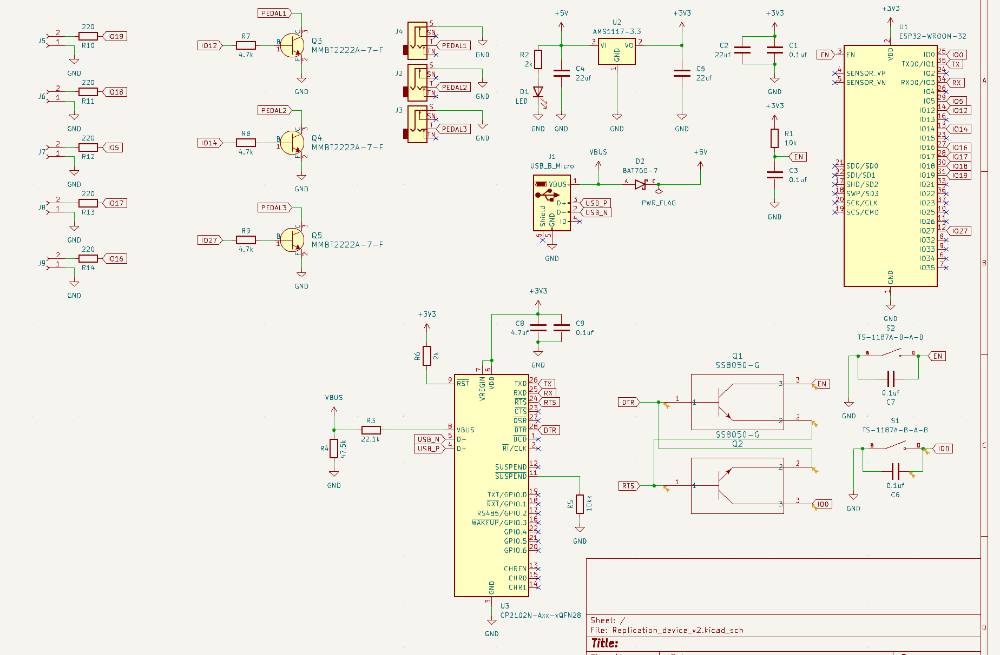
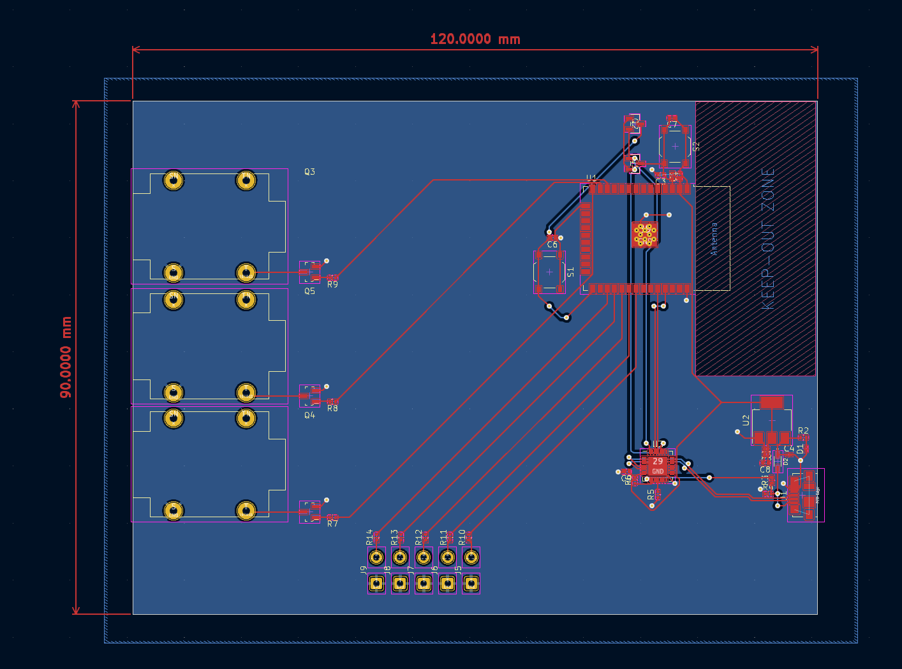

# Piano-Pedal-Accessibility-Device (PPAD)
Northeastern University Capstone 2023 Open Source Repository for our PPAD system. Software designed by Roberto Chadwick, Lucas Laya Marina, and Luke Wisner. Hardware designed by Hanchen Liu, Josh Moffat, and Tristan Siu.

### General Overview
This project provides a way for people with a disability to use their piano pedals by tracking their head tilt and replicating it as pedal presses. The app is only for iOS devices, as we used Apple's Vision Library to get the necessary head tracking data. We wanted to make our work open-source so that anyone could make this device for themselves or anyone they know who would like the ability to use their piano pedals. Through the device that you plug into the piano port and the iOS application, we have created a system that can replicate pedal presses for one or three pedals. 

This idea began as a way to help Jonathan Goodwin for our engineering capstone project. Jonathan is a retired stunt performer and a current keynote speaker. Follow him at: https://www.instagram.com/jonathangoodwinofficial/?hl=en

Jonathan loves to play the piano, but he is unable to use the pedals because he was paralyzed from the waist down in an accident. We set out to create a device that would allow him to once again get full use from his piano. Through our initial meetings with Jonathan, we were able to discern the simplest, most intuitive way to make that possible: using the tilt of his head. The solutions that exist today all require the user to bite down on or blow into a device, but that would prevent Jonathan from being able to sing when he plays. The head tilt became the perfect solution because it fixed this issue while remaining intuitive to the user.

## Hardware
### Hardware Overview
One half of the PPAD system is the device that plugs into the back of the piano and replicates the pedal press signal. Anyone who wants to use this design in the future will need a chip capable of sending and recieving data over bluetooth (we used an ESP32 as a relatively inexpensive option so our schematics match that). In addition, they will need a way to power the device through micro-USB and connect the device to their piano pedal port using 1/4-inch jacks.

### Hardware Replication
The necessary KiCad files (schematic and PCB layout) have been added to allow anyone to replicate our board for their own personal use. The following images display the schematic design as well as the PCB layout of the components and traces involved in integrating all the parts of the board. 

In terms of the manufacturing and assembly process, orders can be made through various PCB manufacturers (we used JLCPCB.com) and provide them with our PCB/schematic files to make an order. Below is the part list with links to sites to purchase each component. (NOTE: You can also import the provided files into the KiCad project manager to view/make any changes to the project) In terms of assembly, be sure to solder on the components that are not already assembled onto the board from the manufacturer (i.e. 1/4" sockets...).

Parts List:
- 1/4" Socket: https://www.amazon.com/dp/B07MR2TT3Q?psc=1&smid=A34H4GNHCXU7L2&ref_=chk_typ_imgToDp
- LEDs: (https://www.amazon.com/eBoot-Pieces-Emitting-Diodes-Assorted/dp/B06XPV4CSH/ref=sr_1_8?crid=1UQGUEZ7QY5KU&keywords=leds&qid=1701737252&sprefix=leds%2Caps%2C88&sr=8-8&th=1)
- ESP32 Chip: https://www.amazon.com/Development-Microcontroller-Integrated-Antenna-Amplifiers/dp/B09GK74F7N/ref=sr_1_1_sspa?crid=18ESI34J05HVB&keywords=esp32&qid=1701737319&sprefix=esp32%2Caps%2C82&sr=8-1-spons&sp_csd=d2lkZ2V0TmFtZT1zcF9hdGY&psc=1

### Three Pedal Proprietary Cable
Using three pedals with the device is a little more complicated because of how digital pianos are made. Any piano that can have a three pedal attachment makes that connection through a proprietary cable instead of a standard 1/4-inch jack, so it was impossible to design a one-size-fits-all solution. Any users who want to use this functionality will have to create their own cable that ends in three 1/4-inch jacks to connect to the device. That way the other end of that cable can be the proper connection port that will work for their specific piano.

## Software
### Software Overview
The other half of the PPAD system is the iOS application that detects the head tilt and sends the signal over bluetooth to the device. The app can be pushed to a TestFlight app for sharing with others, or the user can build directly to their phone through XCode. The app contains settings for selecting one or three pedals, changing the tilt direction, adjusting the threshold angle that triggers the tilt, toggling hold, and toggling inverse. The app has an additional page to give the user some directions on how to connect to the device through bluetooth, and the best way to orient the phone when beginning a session. When the session view is started, it takes all of the saved data from settings, tracks the users face, and begins sending data to the device to replicate the signal of the pedal press.

### Firmware Overview
The firmware that needs to be uploaded to the ESP32 chip also exists within this repository. It activates the necessary GPIO pins when it recieves the packet from the application and it also contains the code necessary to establish the bluetooth connection. The app needs to be open ahead of time because when the device is powered on it begins searching for a connection. The firmware then reads the sent byte to determine if any of the pedals are held down and which GPIO pins are activated if so.

### Bluetooth Connection
As stated above, the device establishes a connection when it is powered on, and the app with the corresponding UUID identifier will be what it connects to. When the session is started in the app, it begins sending bytes where the last 3 bits trigger which pedals are currently being held down. 

### Head Tracking
The head tracking uses Apple's Vision Library to isolate features on the face and then return facial position data. This data includes the roll (tilting head side to side) and the pitch (tilting head up and down) in radians which allow us to determine the angle from the center position. The session tracks if the input radian threshold has been passed using this data, and that determines what data we send to the device to press the correct pedal. There is also a debounce implemented to prevent data flip-flopping when the user keeps their head right on the threshold. Additionally, the polling rate of the data is based on how new the iOS device is. The newer the device the smoother it will function, and we don't recommend running this system on anything older than an iPhone X.

### Navigating Settings
The settings page in the top right corner of the app allows the user to adjust what feels best to them when the session is running. There are two tabs for one pedal and three pedal, which determines if the session will try to detect one or three directions. In the one pedal tab, the user has the ability to determine which way they want to tilt their head to pass the threshold, either left, right, both, or down. In addition, there are options to toggle inverse which presses the pedal unless the threshold is crossed, and toggle hold which keeps the state of the pedal when the threshold is crossed. There is a slider to adjust the angle with an example threshold bar beneath so that the user can test that angle and see what feels best for them. It was important to us to give the user as much freedom as possible to configure their sessions however they wanted to be natural for them.

In the three pedal system, the same options are available, except the ability to hold and change directions for each pedal. The sustain and sostenuto pedals can have their directions switched to change which one is left and right, but the soft pedal is locked as tilting downward. This is because when playing the piano, the soft pedal is the only other pedal that can be used in tandem with the other two. Given that you can't tilt your head both left and right at the same time, but you can tilt down and right, we decided to keep the soft pedal as only down. Each of these three pedals has the ability to be active or inactive, so if a song doesn't require a specific pedal, you can turn it off to avoid triggering it by accident. These pedals also all have angle adjustment sliders and threshold bars to give the user a visual on what angles would work best for them.

When the session begins, the saved settings variables are processed between specified cases that run the head tracking logic. There is a case to handle every possible combination of toggles and angle values in both the one and three pedal systems. The user can then see these settings in action through the indicator bars in the session view. There are the same threshold bars to show how far the user's head is tilting, and at the bottom there are indicator bars to show which pedals are activated and sending a signal to the device.

### Software Replication
To replicate the software, the user will need to flash the firmware onto the chip they have started using. From there, the app can be run through XCode with no additional changes and be built to an IPhone for testing. Additionally, if the user wants to share the app with others, they can get and Apple Developer License and push the app to TestFlight where it can be downloaded on any iOS device. The backend functions that deal with bluetooth connection and face tracking can be found in the model, and all of the frontend app pages can be found in the view. 

## Additional Implementations 
Another reason that we wanted to make this code publiclly available is that it has so many other applications to help anyone with disabilities. We designed the app with a piano in mind, but the code can be repurposed to work with another instrument such as a guitar or drumset. Further beyond this, the head tracking functions could be expanded upon to communicate with non-instrument devices like a wheelchair. We hope that this code can help any who use it!
